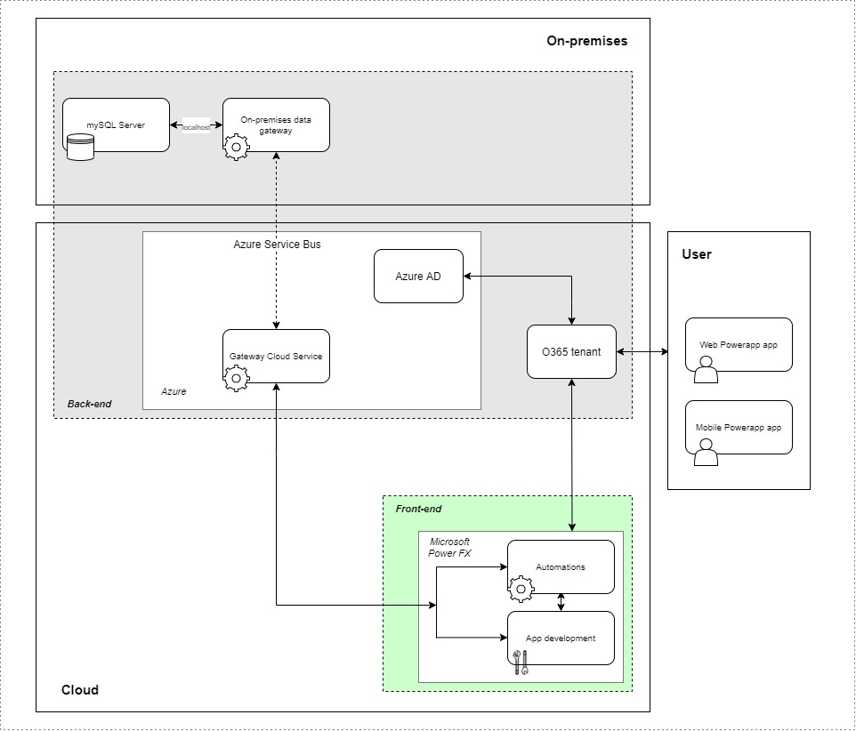
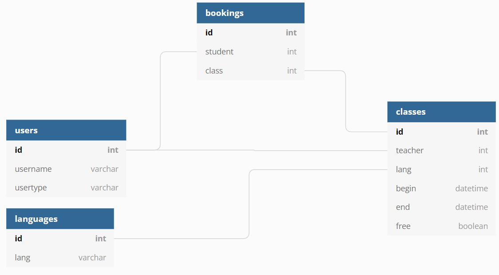

# Trabalho Prático

## iMonitorias - Programa de Monitoria de Idiomas na UFMG

## DCC603 - Engenharia de Software

### Squad AGIL

- **A**rthur Henrique Dias Nunes -2018020670
- **G**abriel Pimentel Gomes - 2018020271
- **I**gor Menezes Radichi - 2018020441
- **L**ucas Gabriel Santana - 2018072476

### Como usar o Aplicativo
TBA

### O Projeto

O projeto tem como objetivo conectar professores (graduados ou não) da UFMG - principalmente em Letras, com especialização em ensino de línguas - com alunos da universidade que desejam **aprender ou praticar um novo idioma**, a princípio gratuitamente. Seria uma **troca de experiências**, podendo evoluir para um acordo entre as partes que possa - ou não - envolver dinheiro e prolongar ou formalizar os encontros, o que dependeria exclusivamente das partes e não envolveria o escopo do app.

#### Backlog do Produto

Glossário:

Usuário -> Professor ou Estudante

Aula -> idioma/hora/professor 

| História | Como um | Eu quero | De forma que eu | Sprint 1 |
|----------|---------|----------|-----------------|----------|
| 1 | Usuário | Fazer um cadastro | Preencha meu perfil para que os outros me encontrem | ☑️ |
| 2 | Usuário | Fazer o cadastro com meu @ufmg | Preencha alguns dados do perfil automaticamente | ☑️ |
| 3 | Usuário | Acessar meu perfil | Consiga modificá-lo | ☐ |
| 4 | Estudante | Visualizar e pesquisar por idioma e data | Encontre professores capacitados disponíveis | ☑️ |
| 5 | Estudante | Selecionar uma aula  | Consiga fazer uma reserva | ☑️ |
| 6 | Professor | Ver quem quer me reservar | Consiga aceitar ou recusar baseado no perfil | ☐ |
| 7 | Professor | Entrar na minha agenda | Colocar meus horários disponíveis | ☑️ |
| 8 | Usuário | Entrar no aplicativo | Veja meus compromissos passados e futuros | ☐ |
| 9 | Usuário | Acessar um compromissos | Cancelá-la ou solicitar para remarcar | ☐ |
| 10 | Usuário | Integração com o Teams | Tenha o evento automaticamente marcado ou desmarcado | ☐ |

#### Equipe

- **A**rthur Henrique Dias Nunes - **Backend**
- **G**abriel Pimentel Gomes - **Frontend**
- **I**gor Menezes Radichi - **Backend**
- **L**ucas Gabriel Santana - **Frontend**

#### Backlog do Sprint 1
- História 1:

| Tarefa | Responsável | Status |
|--------|-------------|--------|
| Definir a estrutura do Banco de Dados para o usuário | Igor | ☑️ |
| Implementar a estrutura no banco de dados. Iniciar o banco de dados | Arthur | ☑️ |
| Adicionar tabela como fonte de dados | Gabriel | ☑️ |
| Implementar a interface para o cadastro | Lucas | ☑️ |

- História 2

| Tarefa | Responsável | Status |
|--------|-------------|--------|
| Coletar as informações (usuário, email, etc) do login da ufmg | Gabriel | ☑️ |
| Implementar lógica responsável por verificar se o usuário já está cadastrado | Lucas | ☑️ |

- História 4

| Tarefa | Responsável | Status |
|--------|-------------|--------|
| Implementar a pesquisa na tela | Lucas | :hourglass: |
| Mostras os resultados (mesmo sem pesquisa) na tela | Gabriel | :hourglass: |

- História 5

| Tarefa | Responsável | Status |
|--------|-------------|--------|
| Implementar a interface para solicitar a reserva de uma aula | Gabriel | ☐ |

- História 7

| Tarefa | Responsável | Status |
|--------|-------------|--------|
| Definir a estrutura do Banco de Dados para as "agendas" dos professores | Arthur | ☑️ |
| Implementar a estrutura no banco de dados | Igor | ☑️ |
| Implementar a interface para selecionar/adicionar/remover entradas na "agenda" do professor | Lucas | ☐ |

- História 10

| Tarefa | Responsável | Status |
|--------|-------------|--------|
| Automação com o Teams para marcar/desmarcar eventos | Igor | ☐ |
| Integrar automação à criação de Solicitações | Lucas | ☐ |

- História 0 (Outras tarefas):

| Tarefa | Responsável | Status |
|--------|-------------|--------|
| Definir versionamento do Frontend | Lucas | ☑️ |
| Criar Github Action | Igor | ☑️ |
| Implementar o banco de dados em docker | Arthur | ☑️ |

### Tecnologias

- Docker
- Banco de dados (mySQL)
- On-premises gateway (ponte com a nuvem)
- Power Platform (automations & app, na nuvem ou local)
- GitHub para versionamento de código
  - Utilização de Actions no GitHub para automatizar exports
  - (opcional) PowerApps-Language-Tooling
- Office 365 (Teams, Outlook, etc)

#### Arquitetura
 

#### Diagrama de banco de dados relacional

### Configurar o Ambiente de Desenvolvimento

#### Banco de Dados Docker

[Configure e inicie a sua base de dados docker](/docker_mysql/).

#### On Premises Gateway

[Configure seu gateway padrão](/gateway).

#### GitHub Actions

[Automatize o export da solução](/.github/workflows).

#### Versionamento do Git

Ao implementar uma nova feature, faça como [o gitflow definido](/.github/gitflow).

### Referências

- [Engenharia de Software Moderna](https://engsoftmoderna.info)
